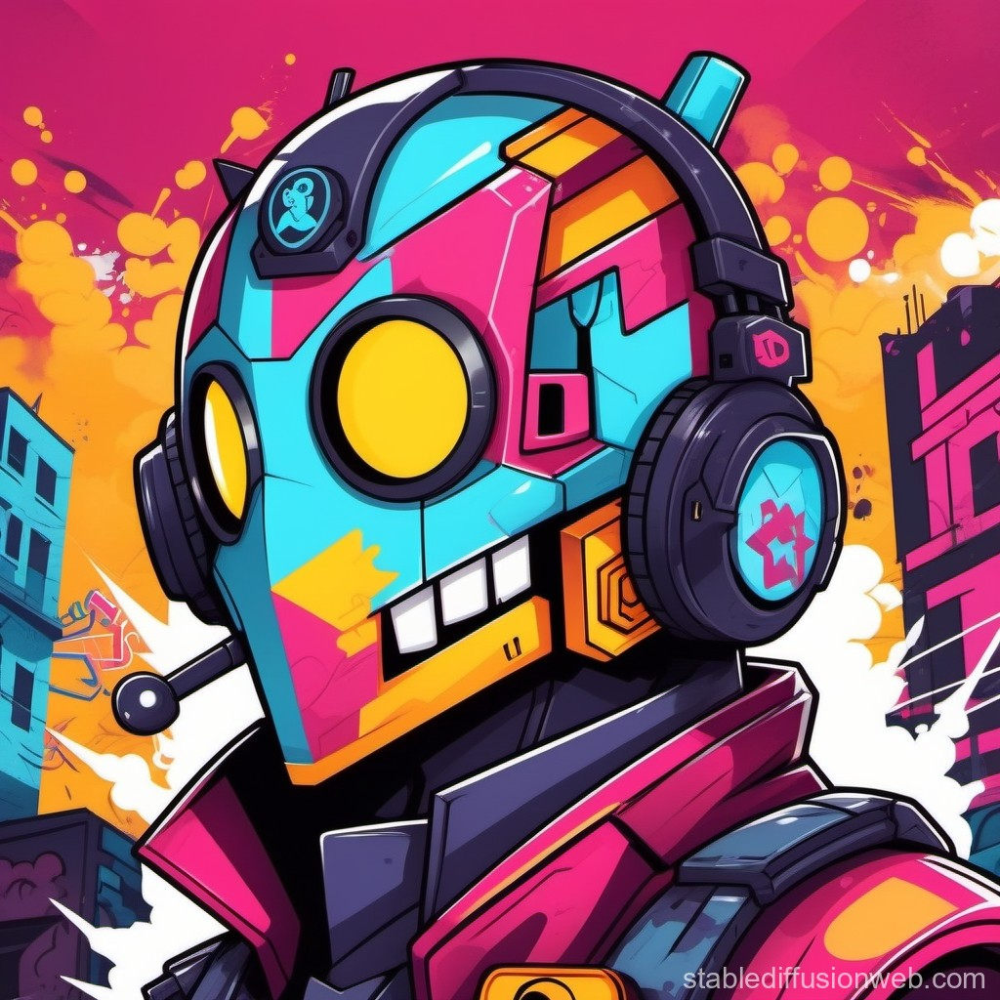

# Assistente de IA no WhatsApp com Gemini

<div align="center">
  
</div>

## Índice

- [Descrição do Projeto](#descrição-do-projeto)
- [Funcionalidades](#funcionalidades)
- [Estrutura de Pastas](#estrutura-de-pastas)
- [Configuração do Google Cloud Vertex AI](#configuração-do-google-cloud-vertex-ai)
- [Execução do Projeto](#execução-do-projeto)
- [Dependências Principais](#dependências-principais)
- [Variáveis de Ambiente](#variáveis-de-ambiente)
- [Comandos de Execução](#comandos-de-execução)

---

## Descrição do Projeto

Este projeto utiliza a inteligência artificial do Gemini para criar um assistente virtual que interage com os usuários via WhatsApp. O bot foi desenvolvido para responder a três prompts específicos, proporcionando uma experiência personalizada para os usuários:

- **Vasco**: O bot oferece respostas e interações sobre o time de futebol Vasco, com informações históricas, estatísticas e curiosidades.
- **Pokémon**: O bot interage com os usuários sobre o universo Pokémon, compartilhando dados sobre os jogos, personagens e eventos.
- **Compra Rápida**: O bot apresenta algumas informações formais sobre a empresa, incluindo sua missão de otimizar o processo de checkout, reduzir o abandono de carrinhos e aumentar as taxas de conversão dos lojistas.

A integração entre WhatsApp e Gemini permite que o bot tenha uma comunicação natural e fluida com os usuários, atendendo suas dúvidas e necessidades de forma interativa.

## Funcionalidades

- **Checkout com um Clique**: Os consumidores podem realizar compras rapidamente, sem precisar preencher os dados em cada transação.
- **Preenchimento Automático**: O sistema completa automaticamente os dados de endereço e pagamento, melhorando a eficiência.
- **Redução do Abandono de Carrinhos**: Minimiza as barreiras ao checkout e aumenta as taxas de conversão.

## Estrutura de Pastas

```bash
compra-rapida/
├── dist/
├── jest-e2e.json
├── logs/
├── nest-cli.json
├── node_modules/
├── package.json
├── package-lock.json
├── src/
│   ├── app.module.ts
│   ├── common/
│   │   ├── config/
│   │   │   ├── public/
│   │   │   └── secret/
│   │   ├── interceptors/
│   │   └── interface/
│   ├── core/
│   │   ├── connection/
│   │   ├── database/
│   │   ├── logger/
│   │   └── useCases/
│   ├── main.ts
│   ├── modules/
│   └── test/
└── tsconfig.build.json
└── tsconfig.json

```

## Descrição das Pastas

### `/src/core`

A pasta `core` contém a estrutura principal da aplicação, organizada de forma a suportar funcionalidades centrais como conexão, banco de dados, e execução dos casos de uso.

- **`connection`**: Contém arquivos relacionados à conexão com bancos de dados ou outras fontes de dados.
- **`database`**: Scripts e arquivos responsáveis pela configuração e interação com o banco de dados.
- **`logger`**: Implementações e configurações relacionadas ao registro de logs da aplicação.
- **`useCases`**: Pasta que armazena os casos de uso da aplicação, cada um responsável por uma funcionalidade específica do sistema.

### `/src/common`

A pasta `common` armazena utilitários e configurações compartilhadas por toda a aplicação.

- **`config`**: Contém configurações de ambiente, como variáveis e configurações de serviços externos.
  - **`public`**: Configurações acessíveis publicamente, como prompts para interações do bot.
  - **`secret`**: Contém configurações sensíveis, como chaves de API e credenciais, garantindo que elas não sejam expostas no código público.
- **`interceptors`**: Scripts de interceptação para modificar ou manipular requisições/respostas.
- **`interface`**: Armazena interfaces TypeScript utilizadas em toda a aplicação.

### `/src/modules`

A pasta `modules` contém módulos específicos da aplicação, como funcionalidades de integração com APIs externas, ou serviços internos.

### `/src/test`

A pasta `test` contém os testes unitários e de integração da aplicação. Ela organiza os testes de maneira a garantir que os componentes e serviços da aplicação funcionem conforme esperado.

## Funcionalidades

### Geração de Modelos AI com Google Cloud Vertex AI

O principal objetivo dessa aplicação é fornecer interação inteligente via IA utilizando o **Google Cloud Vertex AI**. O fluxo de geração de modelos da IA depende da escolha do módulo ativo, como "compra", "pokemon" ou outros.

- **Módulo Compra Rápida**: O sistema utiliza prompts específicos para interagir com o usuário sobre o processo de compras rápidas, garantindo uma experiência de compra otimizada e eficiente.
- **Módulo Pokémon**: Fornece interações relacionadas ao mundo dos Pokémon, respondendo com informações e curiosidades sobre jogos, personagens e mais.
- **Módulo Vasco**: Embora o foco atual seja no módulo de compras rápidas e Pokémon, o sistema também pode ser configurado para fornecer informações sobre outros temas, como times de futebol.

### Configuração de Prompts

Os prompts usados pela IA são configurados em módulos específicos, permitindo que a IA interaja de acordo com o contexto definido pelo módulo ativo. Cada módulo tem uma série de respostas e interações adaptadas ao seu foco.

### Conexões com o Google Cloud

O projeto é integrado com a API **Google Cloud Vertex AI**, permitindo que a aplicação se beneficie dos modelos de linguagem e geração de texto avançados, com segurança e personalização através da configuração de parâmetros como **safetySettings**.

---

Esse projeto tem como objetivo ser um sistema inteligente, onde os módulos de interação (compra rápida, Pokémon, e outros) podem ser configurados de maneira flexível, mantendo o foco no contexto de cada situação, e gerenciando a comunicação com a IA de forma eficiente e personalizada.

## Funcionalidades Adicionais

### Sistema de Prompt Personalizado

Cada módulo de interação com o usuário é alimentado por um conjunto de prompts específicos, que orientam o comportamento da IA para responder de forma alinhada ao objetivo do módulo.

- **Compra Rápida**: O prompt define claramente que a IA deve focar em explicações e interações sobre o sistema de compras rápidas, mantendo um tom formal e técnico.
- **Pokemon**: A IA é configurada para fornecer curiosidades, detalhes sobre o universo Pokémon, sem sair do escopo do jogo ou universo relacionado.
- **Vasco**: Um módulo adicional focado em responder perguntas sobre o time de futebol Vasco, oferecendo curiosidades e informações históricas.

### Segurança e Filtragem de Conteúdo

A configuração de segurança é uma parte importante da integração com o Google Cloud Vertex AI. A IA é configurada para filtrar conteúdos prejudiciais e indesejados, garantindo que a resposta gerada esteja dentro de um nível de segurança adequado. A segurança é configurada com a categoria **HARM_CATEGORY_DANGEROUS_CONTENT**, bloqueando conteúdos com um nível de risco médio ou mais alto.

### Armazenamento de Configurações

As configurações de segurança, prompts e informações da IA são armazenadas em arquivos de configuração, permitindo fácil acesso e modificação sem a necessidade de alterar o código-fonte diretamente.

- **VertexConfig**: Contém informações do projeto e as configurações dos modelos, como o `textModel` e `visionModel`.
- **Prompts de Sistema**: Estão organizados em módulos, permitindo que cada módulo tenha um comportamento distinto, dependendo da necessidade do usuário.

## Executando o Projeto

### Requisitos

- Node.js versão 20 .
- Google Cloud SDK configurado com acesso ao Google Vertex AI.
- Configurações de segurança e API do Google Cloud corretamente definidas no arquivo `vertexConfig`.

## Dependências Principais

- @google-cloud/vertexai: Integração com o Vertex AI para modelos de IA generativos.
- @nestjs/core: Framework principal para construção do projeto.
- node-fetch: Biblioteca para requisições HTTP no Node.js.
- winston: Logger para registro de logs no projeto.

## Variáveis de Ambiente

As variáveis de ambiente são configuradas em arquivos específicos dentro do projeto, e são essenciais para a integração com serviços externos, como o **Google Cloud Vertex AI**, e para a configuração do banco de dados local. Abaixo estão os detalhes das variáveis de ambiente utilizadas no projeto.

## Configuração do Google Cloud Vertex AI

A configuração do **Google Cloud Vertex AI** é armazenada no arquivo `vertexConfig`. Esta configuração define as informações de conexão com o Google Cloud, incluindo o ID do projeto, a localização do serviço e os modelos de IA utilizados. O conteúdo deste arquivo é o seguinte:

```typescript
export const vertexConfig = {
  project: "xxxxxxxxx", // ID do projeto no Google Cloud
  location: "xxxxxxxxx", // Localização do serviço Vertex AI
  textModel: "xxxxxxxxx", // Modelo de IA para processamento de texto
  visionModel: "xxxxxxxxx", // Modelo de IA para visão computacional
};
```

## Execução do Projeto

Este projeto é uma aplicação desenvolvida com o [NestJS](https://nestjs.com/), que integra um bot de WhatsApp com inteligência artificial, utilizando o Gemini para fornecer respostas baseadas em prompts específicos.

## Requisitos

Antes de iniciar a execução, verifique se você possui os seguintes requisitos:

- Node.js (versão 16 ou superior)
- NestJS CLI (`npm install -g @nestjs/cli`)
- Docker (opcional, caso queira usar um contêiner para o banco de dados)
- Yarn ou npm para gerenciar pacotes

## Passos para Execução

### 1. Clonar o Repositório

Clone o repositório do projeto em sua máquina local:

```bash
git clone https://github.com/rafaelmasselli/technical-test-ai-chat
cd technical-test-ai-chat
```

### 2. Instalar dependências

[Use o gerenciador de pacotes de sua preferencia](https://luby.com.br/desenvolvimento/software/tutoriais/gerenciador-de-pacotes/)
Execute a instalação

```bash
npm install
```

### 3. Inicie o projeto

Siga os comandos de execução para iniciar o projeto de usa preferencia

- [Comandos de Execução](#comandos-de-execução)

## Comandos de Execução

1. **Desenvolvimento com o Módulo de IA da Compra Rápida**:
   Para iniciar o projeto no modo de desenvolvimento com o módulo de "compra rápida", execute o comando abaixo:

```bash
npm run dev:compra
```

2. **Desenvolvimento com o Módulo de IA do Pokemon**:

Para rodar o módulo Pokémon, utilize o seguinte comando:

```bash
 npm run dev:pokemon
```

3. **Desenvolvimento com o Módulo de IA do Vasco**:

Para rodar o módulo do vasco, utilize o seguinte comando:

```bash
 npm run start:dev
```
